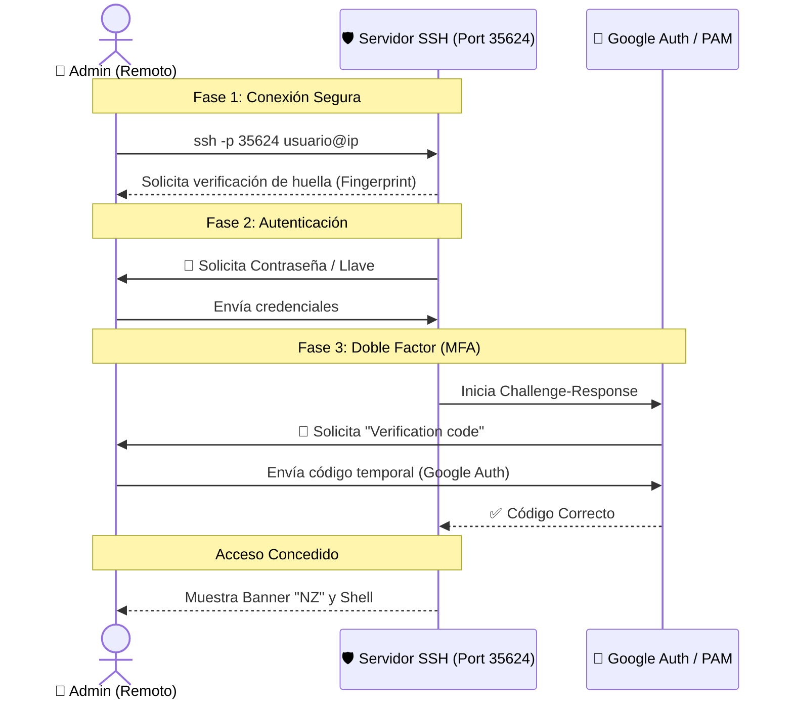
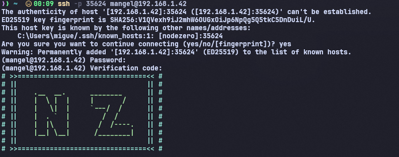

# 🛡️ SSH Hardening & Server Securing Lab

**Estado del proyecto:** Completado ✅

---

## 📋 Resumen del Proyecto
Este repositorio documenta el proceso de **bastionado (hardening)** de un servidor SSH en Linux expuesto a la red. El objetivo principal es reducir la superficie de ataque del servicio SSH, mitigando riesgos comunes como ataques de fuerza bruta, acceso no autorizado y escalada de privilegios.

## ⚠️ Modelo de Amenazas (¿Por qué hacer esto?)
La configuración por defecto de SSH prioriza la compatibilidad sobre la seguridad. Sin este bastionado, el servidor era vulnerable a:
* **Ataques de Fuerza Bruta:** Debido al uso del puerto 22 y permitir contraseñas débiles.
* **Movimiento Lateral/Escalada:** Debido al acceso directo del usuario `root`.
* **Sesiones Zombis:** Riesgo de secuestro de sesión por falta de Timeouts.

## 🛠️ Medidas de Seguridad Implementadas

He modificado el archivo `/etc/ssh/sshd_config` aplicando las siguientes directivas de seguridad según las mejores prácticas (CIS Benchmarks / OWASP):

| Medida | Configuración | Razón de seguridad |
| :--- | :--- | :--- |
| **Deshabilitar Root** | `PermitRootLogin no` | Obliga a entrar como usuario estándar y escalar con `sudo`, dejando auditoría. |
| **Cambio de Puerto** | `Port 35624` | Seguridad por oscuridad (capa extra) para evitar escáneres masivos en el puerto 22 y ataques automáticos de bots. |
| **Autenticación PubKey** | `PubkeyAuthentication yes` | Elimina el riesgo de robo de contraseñas. Autenticación por clave pública. |
| **Deshabilitar Passwords** | `PasswordAuthentication no` | Fuerza el uso exclusivo de claves pública/privada. |
| **Usuarios Permitidos** | `AllowUsers [tu_usuario]` | Capa extra de control: solo permite login a usuarios explícitos (Mínimo Privilegio). |
| **Grupos Permitidos** | `AllowGroups [tu_grupo]` | Restricción granular basada en roles/grupos del sistema. |
| **Timeout de Sesión** | `ClientAliveInterval 300` | Cierra sesiones inactivas automáticamente tras 5 minutos. |
| **Módulos PAM** | `usePAM yes` | Activa la autenticación por módulos PAM para el doble factor de autenticación. |
| **Challenge-Responses** | `KbdInteractiveAuthentication yes` | Habilita el desafío-respuesta, necesario para solicitar el código TOTP (Google Auth/YubiKey). |

> **Nota sobre 2FA:** La directiva KbdInteractiveAuthentication se habilita específicamente para permitir el uso de Google Authenticator. Se ha configurado el stack de PAM (/etc/pam.d/sshd) para requerir tanto la llave SSH como el código temporal (MFA), evitando que esta configuración reabra la vulnerabilidad de login por contraseña simple.

---

## 🔄 Flujo de Autenticación Segura
El siguiente diagrama ilustra cómo el servidor intercepta la conexión y exige el segundo factor antes de conceder la shell:


## ✔️ Evidencia de Bastionado y 2FA
En la siguiente captura se demuestra la conexión exitosa al servidor aplicando las políticas de seguridad:
1. Conexión a través del **puerto no estándar 35624**.
2. Aceptación de la huella digital del servidor (Fingerprint).
3. Solicitud de **Código de Verificación (2FA/OTP)** obligatoria para acceder.
4. Banner de bienvenida personalizado para disuasión/aviso legal.



## 💻 Configuración y Snippets

### 1. Generación de claves (Cliente)
Uso de algoritmo **Ed25519** (más seguro y rápido que RSA).
```bash
ssh-keygen -t ed25519
```

### 2. Transferir la clave al servidor
Se transfiere la clave pública del cliente al servidor
```bash
ssh-copy-id -p 35624 <usuario>@<direccion_ip_servidor>
```

### 3. Acceso al Servidor mediante Clave Pública
Acceso al servidor ssh mediante clave
```bash
ssh -i <ruta_clave_privada> <usuario>@<direccion_ip_servidor>
```
